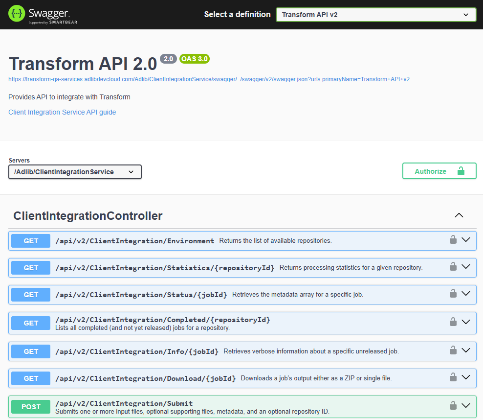

# Adlib Transform — REST API v2 (Client Integration Service)

Customer Integration Guide

> **Audience:** Customers integrating with **Adlib Transform** via REST API.
> **Assumption:** Transform is already deployed (containers or VMs) and reachable from your network.
> **Swagger UI:** `https://transform-services-url/Adlib/ClientIntegrationService/swagger/index.html?urls.primaryName=Transform+API+v2`
> **Service base URL:** `https://transform-services-url/Adlib/ClientIntegrationService/`
> **Postman** A postman collection is provided for you to quickly get testing [CIS 2.0.postman_collection.json](README/postman.json)
>
> 

---

## 1) Concepts and high-level flow

A typical integration uses this loop:

1. **Generate an API key** in the Transform **API Key Manager** (UI).
2. **Discover repositories** with `GET Environment`.
3. **Submit** one or more input files (and optional supporting files + metadata) with `POST Submit` to create a job.
4. **Poll** until the job is complete using:

   * `GET Status/{jobId}` (single job)
   * or `GET Completed/{repositoryId}` (batch polling)
5. **Download** results with `GET Download/{jobId}`
6. **Release** the job with `PUT Release/{jobId}` so it won’t show up in future polls.

---

## 2) Authentication (required on every request)

Transform API v2 uses an API key passed via header:

* Header name: **`X-Api-Key`**
* Add it to **every** request.

Example:

```http
X-Api-Key: <YOUR_API_KEY>
```

### Generate an API key

In the Transform UI, open **Transform API Key Manager**, create a new key, then copy/store it securely (treat it like a password). Use that value in the `X-Api-Key` header for all calls.

---

## 3) Base URL and endpoint patterns

All v2 endpoints are under:

```
https://transform-services-url/Adlib/ClientIntegrationService/api/v2/ClientIntegration/
```

Example (provided):
`GET https://transform-services-url/Adlib/ClientIntegrationService/api/v2/ClientIntegration/Environment`

---

## 4) Common responses and data types

Most JSON responses include:

* `success` (boolean)
* `message` (string, optional)

For example, **EnvironmentResponse** includes repositories and global variables.

Job status responses return fields like:

* `jobId`, `repositoryId`, `status`, `details`
* `totalQueueTimeInSec`, `totalProcessingTimeInSec`

---

## 5) Getting started walkthrough (recommended)

### Step A — Get repositories and environment info

**Endpoint**: `GET Environment`
**URL**: `.../Environment`

**cURL**

```bash
curl -sS -X GET \
  "https://transform-services-url/Adlib/ClientIntegrationService/api/v2/ClientIntegration/Environment" \
  -H "X-Api-Key: $TRANSFORM_API_KEY"
```

**What you get back**

* A list of repositories (IDs + names + rulesets)
* Global variables
* A `lastChanged` timestamp

Pick the `repositoryId` you want to submit into.

---

### Step B — Submit files to create a job

**Endpoint**: `POST Submit`
**URL**: `.../Submit`

This endpoint accepts `multipart/form-data` and returns a **jobId (UUID)** on success.

> **Note:** Swagger UI has limitations for mapping `InputFiles` correctly for multipart uploads; use Postman or your client code instead.

#### Multipart field naming (important)

When sending one or more input files, you must name form parts like:

* `RepositoryId`: `<repo-guid>`
* `InputFiles[0].InputFile`: `<binary file>`
* `InputFiles[0].FileMetadata[0].Name`: `<string>` (optional)
* `InputFiles[0].FileMetadata[0].Value`: `<string>` (optional)
* Repeat for `InputFiles[1]...`, `InputFiles[2]...`, etc.
* Optional supporting files: `SupportingFiles` (repeatable)

#### cURL — submit 1 file (plus per-file metadata)

```bash
REPO_ID="00000000-0000-0000-0000-000000000000"
INPUT_FILE="./input.pdf"

curl -sS -X POST \
  "https://transform-services-url/Adlib/ClientIntegrationService/api/v2/ClientIntegration/Submit" \
  -H "X-Api-Key: $TRANSFORM_API_KEY" \
  -F "RepositoryId=$REPO_ID" \
  -F "InputFiles[0].InputFile=@${INPUT_FILE};type=application/octet-stream" \
  -F "InputFiles[0].FileMetadata[0].Name=Source" \
  -F "InputFiles[0].FileMetadata[0].Value=Uploaded via curl"
```

#### cURL — submit multiple input files + supporting file(s)

```bash
curl -sS -X POST \
  "https://transform-services-url/Adlib/ClientIntegrationService/api/v2/ClientIntegration/Submit" \
  -H "X-Api-Key: $TRANSFORM_API_KEY" \
  -F "RepositoryId=$REPO_ID" \
  -F "InputFiles[0].InputFile=@./a.docx;type=application/octet-stream" \
  -F "InputFiles[1].InputFile=@./b.pdf;type=application/octet-stream" \
  -F "SupportingFiles=@./supporting.zip;type=application/octet-stream"
```

---

### Step C — Poll for completion

You can poll either by **job** or by **repository**.

#### Option 1: Poll a single job

**Endpoint**: `GET Status/{jobId}`

**cURL**

```bash
JOB_ID="11111111-1111-1111-1111-111111111111"

curl -sS -X GET \
  "https://transform-services-url/Adlib/ClientIntegrationService/api/v2/ClientIntegration/Status/$JOB_ID" \
  -H "X-Api-Key: $TRANSFORM_API_KEY"
```

#### Option 2: Poll a repository for completed (unreleased) jobs

**Endpoint**: `GET Completed/{repositoryId}?maxItems=10`

**cURL**

```bash
curl -sS -X GET \
  "https://transform-services-url/Adlib/ClientIntegrationService/api/v2/ClientIntegration/Completed/$REPO_ID?maxItems=10" \
  -H "X-Api-Key: $TRANSFORM_API_KEY"
```

---

### Step D — Download output

**Endpoint**: `GET Download/{jobId}`
Returns either a single file or a ZIP archive (based on the job output).

**cURL**

```bash
curl -L -X GET \
  "https://transform-services-url/Adlib/ClientIntegrationService/api/v2/ClientIntegration/Download/$JOB_ID" \
  -H "X-Api-Key: $TRANSFORM_API_KEY" \
  -o "output_$JOB_ID.bin"
```

Tip: many clients read the `Content-Disposition` header to determine the output filename.

---

### Step E — Release the job (recommended)

**Endpoint**: `PUT Release/{jobId}`
Marks the job as released so it won’t be returned again by `Completed/{repositoryId}`.

**cURL**

```bash
curl -sS -X PUT \
  "https://transform-services-url/Adlib/ClientIntegrationService/api/v2/ClientIntegration/Release/$JOB_ID" \
  -H "X-Api-Key: $TRANSFORM_API_KEY" \
  -i
```

---

## 6) Endpoint reference (v2)

### Environment & repository monitoring

#### `GET Environment`

Returns available repositories and global variables.

#### `GET Statistics/{repositoryId}`

Returns counts by state (queued/transforming/etc.) and averages.

**cURL**

```bash
curl -sS -X GET \
  "https://transform-services-url/Adlib/ClientIntegrationService/api/v2/ClientIntegration/Statistics/$REPO_ID" \
  -H "X-Api-Key: $TRANSFORM_API_KEY"
```

### Job lifecycle

#### `POST Submit`

Creates a new job (multipart upload).

#### `GET Status/{jobId}`

Gets status for a job.

#### `GET Info/{jobId}`

Verbose job info including input/output file info and job metadata.

**cURL**

```bash
curl -sS -X GET \
  "https://transform-services-url/Adlib/ClientIntegrationService/api/v2/ClientIntegration/Info/$JOB_ID" \
  -H "X-Api-Key: $TRANSFORM_API_KEY"
```

#### `GET Completed/{repositoryId}`

Lists completed jobs not yet released (use for polling).

#### `GET Download/{jobId}`

Downloads output.

#### `PUT Release/{jobId}`

Marks completed job as released.

#### `PUT Cancel/{jobId}`

Cancels a queued job (only if still queued).

**cURL**

```bash
curl -sS -X PUT \
  "https://transform-services-url/Adlib/ClientIntegrationService/api/v2/ClientIntegration/Cancel/$JOB_ID" \
  -H "X-Api-Key: $TRANSFORM_API_KEY" \
  -i
```

#### `PUT Metadata/{jobId}`

Replaces the job’s metadata (and/or file metadata) with a new set.

**Example JSON body shape**

* `jobMetadata`: array of `{ name, value }`
* `fileMetadata`: array of file entries (each may include metadata)

**cURL**

```bash
curl -sS -X PUT \
  "https://transform-services-url/Adlib/ClientIntegrationService/api/v2/ClientIntegration/Metadata/$JOB_ID" \
  -H "X-Api-Key: $TRANSFORM_API_KEY" \
  -H "Content-Type: application/json" \
  -d '{
    "jobMetadata": [
      { "name": "CustomerMatterId", "value": "A-12345" },
      { "name": "Priority", "value": "High" }
    ]
  }' \
  -i
```

### AI (Future coming in 2026.1)

#### `POST AiRagChat`

Invokes a RAG chat request  which will reference and deep research all the content previously processed with Adlib Transform from a particular collection of documents:

* `sessionId` (UUID)
* `message`
* `collection`
* `category`

Response includes `resultCode`, `resultMessage`, `metadata`, and `response`.

**cURL**

```bash
curl -sS -X POST \
  "https://transform-services-url/Adlib/ClientIntegrationService/api/v2/ClientIntegration/AiRagChat" \
  -H "X-Api-Key: $TRANSFORM_API_KEY" \
  -H "Content-Type: application/json" \
  -d '{
    "sessionId": "22222222-2222-2222-2222-222222222222",
    "message": "Find documents about contract termination.",
    "collection": "LegalLibrary",
    "category": "Contracts"
  }'
```

---

## 7) Language examples (from the provided sample clients)

Below are representative patterns from the sample client apps (Python + TypeScript), expanded with **Java** and **C#** equivalents. All examples show the same core requirements:

* Base path: `https://transform-services-url/Adlib/ClientIntegrationService/api/v2/ClientIntegration/`
* Add `X-Api-Key` to **every** request
* `Submit` uses `multipart/form-data` field names like `InputFiles[0].InputFile`

> Tip: In all languages, **poll `Status/{jobId}` until completed**, then **download**, then **release**.

---

### Python (aiohttp) — submit + poll + download

Key ideas:

* Add header `X-Api-Key` on every call
* Use multipart field names like `InputFiles[0].InputFile`

```python
import aiohttp
from aiohttp import FormData
import asyncio

BASE = "https://transform-services-url/Adlib/ClientIntegrationService/api/v2/ClientIntegration"
API_KEY = "YOUR_API_KEY"
REPO_ID = "00000000-0000-0000-0000-000000000000"

async def main():
    headers = {"X-Api-Key": API_KEY}

    async with aiohttp.ClientSession() as session:
        # 1) Environment
        async with session.get(f"{BASE}/Environment", headers=headers) as r:
            env = await r.json()
            print("Environment:", env)

        # 2) Submit
        form = FormData()
        form.add_field("RepositoryId", REPO_ID)
        form.add_field(
            "InputFiles[0].InputFile",
            open("input.pdf", "rb"),
            filename="input.pdf",
            content_type="application/octet-stream",
        )

        async with session.post(f"{BASE}/Submit", data=form, headers=headers) as r:
            job_id = await r.json()
            print("JobId:", job_id)

        # 3) Status
        async with session.get(f"{BASE}/Status/{job_id}", headers=headers) as r:
            status = await r.json()
            print("Status:", status)

        # 4) Download
        async with session.get(f"{BASE}/Download/{job_id}", headers=headers) as r:
            content = await r.read()
            with open(f"output_{job_id}.bin", "wb") as f:
                f.write(content)

        # 5) Release
        async with session.put(f"{BASE}/Release/{job_id}", headers=headers) as r:
            print("Release HTTP:", r.status)

asyncio.run(main())
```

---

### TypeScript (axios + form-data) — submit + poll

Key ideas:

* `headers: { "X-Api-Key": apiKey }`
* Use `form-data` and merge headers with `form.getHeaders()`

```ts
import axios from "axios";
import fs from "fs";
import FormData from "form-data";

const BASE =
  "https://transform-services-url/Adlib/ClientIntegrationService/api/v2/ClientIntegration/";
const apiKey = "YOUR_API_KEY";
const repoId = "00000000-0000-0000-0000-000000000000";

async function run() {
  const headers = { "X-Api-Key": apiKey };

  // 1) Environment
  const env = await axios.get(BASE + "Environment", { headers });
  console.log("Environment:", env.data);

  // 2) Submit
  const form = new FormData();
  form.append("RepositoryId", repoId);
  form.append("InputFiles[0].InputFile", fs.createReadStream("./input.pdf"), {
    filename: "input.pdf",
  });

  const submit = await axios.post(BASE + "Submit", form, {
    headers: { ...form.getHeaders(), ...headers },
  });

  const jobId = submit.data;
  console.log("JobId:", jobId);

  // 3) Status
  const status = await axios.get(BASE + "Status/" + jobId, { headers });
  console.log("Status:", status.data);

  // 4) Download (binary)
  const download = await axios.get(BASE + "Download/" + jobId, {
    headers,
    responseType: "arraybuffer",
  });
  fs.writeFileSync(`output_${jobId}.bin`, download.data);

  // 5) Release
  await axios.put(BASE + "Release/" + jobId, null, { headers });
}

run().catch(console.error);
```

---

### Java (Java 11+ HttpClient) — submit + poll + download + release

This example uses:

* `java.net.http.HttpClient` for GET/PUT
* A simple helper to build `multipart/form-data` for Submit

> Note: Multipart is verbose in raw HttpClient. Many projects prefer **OkHttp** for cleaner multipart support, but the code below works without external dependencies.

```java
import java.io.*;
import java.net.URI;
import java.net.http.*;
import java.nio.charset.StandardCharsets;
import java.nio.file.*;
import java.util.UUID;

public class TransformClientJava {
    private static final String BASE =
        "https://transform-services-url/Adlib/ClientIntegrationService/api/v2/ClientIntegration";
    private static final String API_KEY = "YOUR_API_KEY";
    private static final String REPO_ID = "00000000-0000-0000-0000-000000000000";

    public static void main(String[] args) throws Exception {
        HttpClient client = HttpClient.newHttpClient();

        // 1) Environment
        HttpRequest envReq = HttpRequest.newBuilder()
            .uri(URI.create(BASE + "/Environment"))
            .header("X-Api-Key", API_KEY)
            .GET()
            .build();

        HttpResponse<String> envResp = client.send(envReq, HttpResponse.BodyHandlers.ofString());
        System.out.println("Environment: " + envResp.body());

        // 2) Submit (multipart/form-data)
        Path inputFile = Paths.get("input.pdf");
        String boundary = "----TransformBoundary" + UUID.randomUUID();

        byte[] multipartBody = buildMultipart(boundary,
            "RepositoryId", REPO_ID,
            "InputFiles[0].InputFile", inputFile, "application/octet-stream"
        );

        HttpRequest submitReq = HttpRequest.newBuilder()
            .uri(URI.create(BASE + "/Submit"))
            .header("X-Api-Key", API_KEY)
            .header("Content-Type", "multipart/form-data; boundary=" + boundary)
            .POST(HttpRequest.BodyPublishers.ofByteArray(multipartBody))
            .build();

        HttpResponse<String> submitResp = client.send(submitReq, HttpResponse.BodyHandlers.ofString());
        String jobId = submitResp.body().replace("\"", ""); // If server returns JSON string UUID
        System.out.println("JobId: " + jobId);

        // 3) Status/{jobId}
        HttpRequest statusReq = HttpRequest.newBuilder()
            .uri(URI.create(BASE + "/Status/" + jobId))
            .header("X-Api-Key", API_KEY)
            .GET()
            .build();

        HttpResponse<String> statusResp = client.send(statusReq, HttpResponse.BodyHandlers.ofString());
        System.out.println("Status: " + statusResp.body());

        // 4) Download/{jobId}
        HttpRequest dlReq = HttpRequest.newBuilder()
            .uri(URI.create(BASE + "/Download/" + jobId))
            .header("X-Api-Key", API_KEY)
            .GET()
            .build();

        HttpResponse<byte[]> dlResp = client.send(dlReq, HttpResponse.BodyHandlers.ofByteArray());
        Files.write(Paths.get("output_" + jobId + ".bin"), dlResp.body());
        System.out.println("Downloaded to output_" + jobId + ".bin");

        // 5) Release/{jobId}
        HttpRequest releaseReq = HttpRequest.newBuilder()
            .uri(URI.create(BASE + "/Release/" + jobId))
            .header("X-Api-Key", API_KEY)
            .PUT(HttpRequest.BodyPublishers.noBody())
            .build();

        HttpResponse<String> releaseResp = client.send(releaseReq, HttpResponse.BodyHandlers.ofString());
        System.out.println("Release HTTP: " + releaseResp.statusCode());
    }

    // Minimal multipart builder for:
    // - One string field
    // - One file field
    private static byte[] buildMultipart(
        String boundary,
        String repoFieldName, String repoValue,
        String fileFieldName, Path filePath, String fileContentType
    ) throws IOException {

        ByteArrayOutputStream out = new ByteArrayOutputStream();
        String CRLF = "\r\n";

        // Text field: RepositoryId
        out.write(("--" + boundary + CRLF).getBytes(StandardCharsets.UTF_8));
        out.write(("Content-Disposition: form-data; name=\"" + repoFieldName + "\"" + CRLF).getBytes(StandardCharsets.UTF_8));
        out.write((CRLF).getBytes(StandardCharsets.UTF_8));
        out.write((repoValue + CRLF).getBytes(StandardCharsets.UTF_8));

        // File field: InputFiles[0].InputFile
        String filename = filePath.getFileName().toString();
        out.write(("--" + boundary + CRLF).getBytes(StandardCharsets.UTF_8));
        out.write(("Content-Disposition: form-data; name=\"" + fileFieldName + "\"; filename=\"" + filename + "\"" + CRLF)
            .getBytes(StandardCharsets.UTF_8));
        out.write(("Content-Type: " + fileContentType + CRLF).getBytes(StandardCharsets.UTF_8));
        out.write((CRLF).getBytes(StandardCharsets.UTF_8));
        out.write(Files.readAllBytes(filePath));
        out.write((CRLF).getBytes(StandardCharsets.UTF_8));

        // End boundary
        out.write(("--" + boundary + "--" + CRLF).getBytes(StandardCharsets.UTF_8));

        return out.toByteArray();
    }
}
```

---

### C# (.NET 6+) — submit + poll + download + release

This example uses:

* `HttpClient` with `DefaultRequestHeaders`
* `MultipartFormDataContent` for Submit (clean + recommended)

```csharp
using System;
using System.IO;
using System.Net.Http;
using System.Net.Http.Headers;
using System.Threading.Tasks;

class TransformClientCSharp
{
    private static readonly string Base =
        "https://transform-services-url/Adlib/ClientIntegrationService/api/v2/ClientIntegration/";
    private static readonly string ApiKey = "YOUR_API_KEY";
    private static readonly string RepoId = "00000000-0000-0000-0000-000000000000";

    static async Task Main()
    {
        using var http = new HttpClient();
        http.DefaultRequestHeaders.Add("X-Api-Key", ApiKey);

        // 1) Environment
        var env = await http.GetStringAsync(Base + "Environment");
        Console.WriteLine("Environment: " + env);

        // 2) Submit (multipart/form-data)
        using var form = new MultipartFormDataContent();

        form.Add(new StringContent(RepoId), "RepositoryId");

        var filePath = "input.pdf";
        var fileStream = File.OpenRead(filePath);
        var fileContent = new StreamContent(fileStream);
        fileContent.Headers.ContentType = new MediaTypeHeaderValue("application/octet-stream");

        // Field name must be: InputFiles[0].InputFile
        form.Add(fileContent, "InputFiles[0].InputFile", Path.GetFileName(filePath));

        // Optional per-file metadata example:
        form.Add(new StringContent("Source"), "InputFiles[0].FileMetadata[0].Name");
        form.Add(new StringContent("Uploaded via C#"), "InputFiles[0].FileMetadata[0].Value");

        var submitResp = await http.PostAsync(Base + "Submit", form);
        submitResp.EnsureSuccessStatusCode();

        var jobIdRaw = await submitResp.Content.ReadAsStringAsync();
        var jobId = jobIdRaw.Replace("\"", ""); // if response is JSON string
        Console.WriteLine("JobId: " + jobId);

        // 3) Status/{jobId}
        var status = await http.GetStringAsync(Base + "Status/" + jobId);
        Console.WriteLine("Status: " + status);

        // 4) Download/{jobId}
        var outputBytes = await http.GetByteArrayAsync(Base + "Download/" + jobId);
        await File.WriteAllBytesAsync($"output_{jobId}.bin", outputBytes);
        Console.WriteLine($"Downloaded output_{jobId}.bin");

        // 5) Release/{jobId}
        var releaseResp = await http.PutAsync(Base + "Release/" + jobId, content: null);
        Console.WriteLine("Release HTTP: " + (int)releaseResp.StatusCode);
    }
}
```

---

### Quick copy/paste: minimal “headers + base URL” template

#### Java

```java
HttpRequest req = HttpRequest.newBuilder()
  .uri(URI.create(BASE + "/Environment"))
  .header("X-Api-Key", API_KEY)
  .GET()
  .build();
```

#### C#

```csharp
http.DefaultRequestHeaders.Add("X-Api-Key", apiKey);
var env = await http.GetStringAsync(baseUrl + "Environment");
```

---
